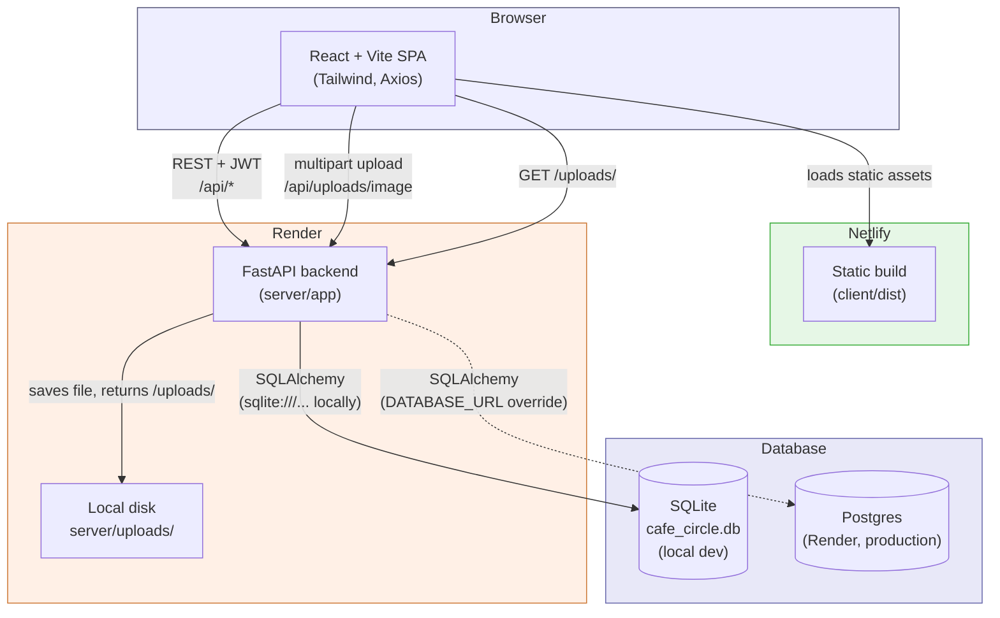
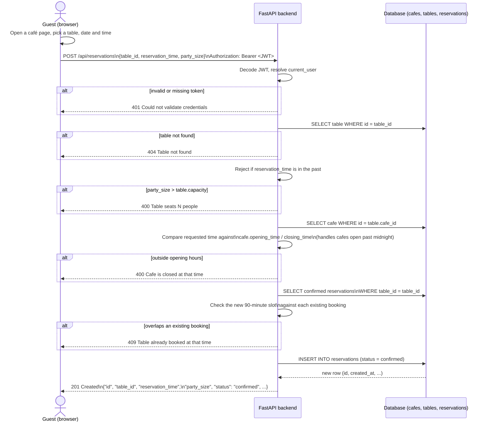
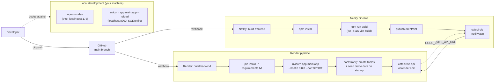

# Project Diagrams

## 1. Architecture Diagram

**Key point:** unlike a setup that uploads straight to a third-party CDN, café cover photos are posted to the FastAPI backend itself (`POST /api/uploads/image`), written to `server/uploads/`, and served back by the same backend at `/uploads/<name>`. This is why uploads are wiped on every Render deploy unless a persistent disk is attached (see the README's Deployment section) — there is no external image host in this stack.

## 2. API Sequence Diagram — Book a Table

## 3. CI/CD Pipeline Diagram

**`npm run dev` vs `npm run build`:** `npm run dev` (top-left box) is only ever run locally, by a developer, while coding — it starts a live-reloading dev server and never touches production. `npm run build` (inside the Netlify pipeline) is what actually produces the static files that get deployed; Netlify runs this itself on every push, not `npm run dev`.

**Why no Alembic step on Render:** locally the app talks to a SQLite file and creates its own tables on startup, so there is nothing to migrate. In production, `DATABASE_URL` is swapped for the Postgres connection string Render provides, but `bootstrap()` still runs `Base.metadata.create_all()` and the demo seed on every startup — it only inserts rows that don't already exist, so redeploys are safe. Alembic is there for hand-written schema changes against that Postgres database, run manually, not as part of the deploy pipeline.